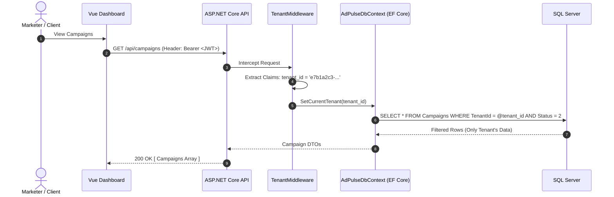
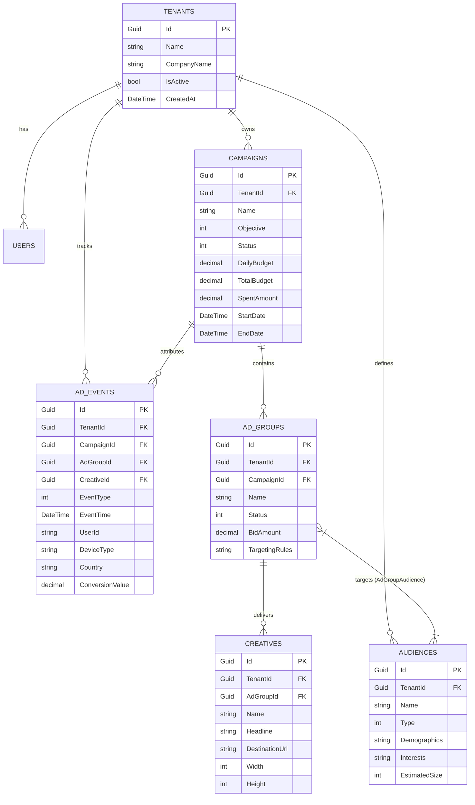

<div align="center">

<div align="center">

<pre align="center">
  █████╗ ██████╗ ██████╗ ██╗   ██╗██╗     ███████╗███████╗
██╔══██╗██╔══██╗██╔══██╗██║   ██║██║     ██╔════╝██╔════╝
███████║██║  ██║██████╔╝██║   ██║██║     ███████╗█████╗  
██╔══██║██║  ██║██╔═══╝ ██║   ██║██║     ╚════██║██╔══╝  
██║  ██║██████╔╝██║     ╚██████╔╝███████╗███████║███████╗
╚═╝  ╚═╝╚═════╝ ╚═╝      ╚═════╝ ╚══════╝╚══════╝╚══════╝
</pre>

</div>

# AdPulse — Real-Time Advertising Campaign Intelligence Platform

**Next-Generation Omnichannel Campaign Intelligence, Event Ingestion & Attribution Engine**

[](https://dotnet.microsoft.com/)
[](https://learn.microsoft.com/en-us/dotnet/csharp/)
[](https://vuejs.org/)
[](https://www.typescriptlang.org/)
[](https://nodejs.org/)
[](https://redis.io/)
[](https://www.microsoft.com/sql-server/)
[](https://www.elastic.co/)
[](https://www.docker.com/)
[](LICENSE)

---

### 📌 Operational Deployment Notice
**AdPulse is a fully working, real, local-first full-stack platform** engineered for laptop demonstrations, technical interviews, and architectural reviews.
- **Local Execution:** 100% runnable offline on Docker Compose, .NET 9, Node.js, and modern browsers.
- **Zero Active Cloud Dependencies:** No active infrastructure is deployed to any cloud platform.
- **Cloud-Ready Architecture:** AdPulse is designed primarily for local development and demonstration. Its containerized architecture and environment-based configuration keep it suitable for future deployment to Azure or other cloud platforms.

</div>

---

## 📑 Master Table of Contents

- [PART I: Non-Technical & Executive Overview](#part-i-non-technical--executive-overview)
  - [1. What is AdPulse? (In Plain English)](#1-what-is-adpulse-in-plain-english)
  - [2. The $600 Billion Problem in Modern Advertising](#2-the-600-billion-problem-in-modern-advertising)
  - [3. How AdPulse Solves It](#3-how-adpulse-solves-it)
  - [4. Business Value & Financial ROI](#4-business-value--financial-roi)
  - [5. Feature Highlights for Product & Marketing Teams](#5-feature-highlights-for-product--marketing-teams)
- [PART II: Deep Technical Architecture (For Engineers & Reviewers)](#part-ii-deep-technical-architecture-for-engineers--reviewers)
  - [6. High-Level Distributed Architecture](#6-high-level-distributed-architecture)
  - [7. Core System Components](#7-core-system-components)
  - [8. Multi-Tenancy & Data Isolation Model](#8-multi-tenancy--data-isolation-model)
  - [9. Non-Blocking Event Ingestion & Caching Pipeline](#9-non-blocking-event-ingestion--caching-pipeline)
  - [10. Dimensional Search & Analytics Engine](#10-dimensional-search--analytics-engine)
  - [11. Relational Database Schema & Domain Model](#11-relational-database-schema--domain-model)
  - [12. Frontend Design System & Real-Time Dashboard](#12-frontend-design-system--real-time-dashboard)
  - [13. Centralized Structured Logging & Observability](#13-centralized-structured-logging--observability)
- [PART III: Future Cloud Readiness (Azure Target Architecture)](#part-iii-future-cloud-readiness-azure-target-architecture)
  - [14. Azure Deployment Architecture](#14-azure-deployment-architecture)
  - [15. Infrastructure as Code &amp; Container Strategy](#15-infrastructure-as-code--container-strategy)
- [PART IV: Operational Guide & Verification Handbook](#part-iv-operational-guide--verification-handbook)
  - [16. Prerequisites Checklist](#16-prerequisites-checklist)
  - [17. Service Directory & Port Directory](#17-service-directory--port-directory)
  - [18. One-Command Quick Start](#18-one-command-quick-start)
  - [19. Step-by-Step Manual Startup](#19-step-by-step-manual-startup)
  - [20. Automated Unit & Boundary Testing](#20-automated-unit--boundary-testing)
  - [21. Live Traffic Simulation Pipeline](#21-live-traffic-simulation-pipeline)
  - [22. Technical Interview Demonstration Script](#22-technical-interview-demonstration-script)
- [PART V: Project & Community](#part-v-project-community)
  - [23. Contributing](#23-contributing)
  - [24. License](#24-license)
  - [25. Author](#25-author)
  - [26. Contact & Support](#26-contact-support)
  - [27. Acknowledgments](#27-acknowledgments)

---

# PART I: Non-Technical & Executive Overview

## 1. What is AdPulse? (In Plain English)

**AdPulse** is a digital advertising command center. It gives marketing leaders, ad agencies, and growth teams complete, real-time control over their advertising campaigns across multiple digital networks (Search, Display, Social, and Video).

Think of AdPulse like the **flight control tower for online advertising**:
- When ads run across Google, social media, or programmatic websites, millions of consumer interactions happen every second.
- AdPulse instantly listens to those signals, verifies whether real humans clicked the ads, calculates exactly which marketing dollars produced actual revenue, and displays the performance live on an executive dashboard.

---

## 2. The $600 Billion Problem in Modern Advertising

Digital advertising is a \$600+ billion annual global industry, yet marketers struggle with three massive structural problems:

```
┌───────────────────────────────┐  ┌───────────────────────────────┐  ┌───────────────────────────────┐
│     1. Walled Garden Opacity  │  │   2. Delayed Attribution      │  │     3. Privacy & Leakage      │
├───────────────────────────────┤  ├───────────────────────────────┤  ├───────────────────────────────┤
│ Tech giants grade their own   │  │ Legacy platforms take 24–48   │  │ Multiple client organizations │
│ homework. Marketers cannot    │  │ hours to report conversions.  │  │ often share agency databases, │
│ independently verify ad clicks│  │ By the time waste is spotted, │  │ creating severe risks of cross-│
│ or true conversion credit.    │  │ budgets are already burned.   │  │ brand audience data leakage.  │
└───────────────────────────────┘  └───────────────────────────────┘  └───────────────────────────────┘
```

1. **Walled Garden Opacity**: Marketers buy ads across multiple networks, but each network claims credit for the same sale (over-reporting conversions by up to 30%).
2. **Delayed Attribution Loops**: Legacy tracking platforms take hours or even days to process click streams. If an ad creative is burning thousands of dollars without converting, marketing teams cannot react fast enough.
3. **Multi-Tenant Privacy & Data Compliance**: Global agencies manage advertising for competing brands (e.g., Nike vs. Adidas). An accidental query leaking one brand's audience targets to another causes disastrous compliance violations.

---

## 3. How AdPulse Solves It

AdPulse delivers an **independent, real-time, multi-tenant intelligence layer**:

- **Real-Time Telemetry**: Captures impressions, clicks, and checkout events in sub-milliseconds rather than hours.
- **Transparent Attribution**: Evaluates ad interactions with strict mathematically verifiable deduplication.
- **Guaranteed Tenant Privacy**: Built on software-enforced cryptographic boundaries where each brand's data is isolated at the root database query level.
- **Unified Command Center**: A sleek single-page dashboard designed for modern growth teams to launch, pause, re-budget, and optimize campaigns in seconds.

---

## 4. Business Value & Financial ROI

| Strategic Advantage | Industry Average | With AdPulse | Tangible Business Outcome |
| :--- | :--- | :--- | :--- |
| **Attribution Lag** | 6 to 24 Hours | **Sub-Second Real-Time** | Reallocate budget from failing ads before wasting daily flight limits |
| **Cross-Tenant Security** | Manual SQL WHERE filters | **Kernel-Level Global Filters** | Zero data contamination between enterprise clients or agency accounts |
| **Data Ownership** | Trapped in vendor silos | **Full Relational & Search Access** | Complete independent verification of ad vendor spend and ROI |
| **Campaign Reaction Time** | Next-day reporting reviews | **Live Interactive Telemetry** | Marketers test creative variants and see conversion response instantly |

---

## 5. Feature Highlights for Product & Marketing Teams

- 🎯 **Hierarchical Campaign Management**: Organize advertising into logical tiers: *Organization &rarr; Campaign &rarr; Ad Groups &rarr; Creative Assets*.
- 👥 **Dynamic Audience Targeting**: Target specific cohorts by demographics (age, seniority), interests (Cloud, SaaS, AI), geographic regions, and consumer devices.
- ⚡ **Live Signal Injection**: Integrated traffic simulation tool to test creative performance and verify attribution tracking under realistic consumer behavior.
- 📊 **Executive Performance Cards**: Real-time Click-Through Rate (CTR), Cost-Per-Click (CPC), and Return on Ad Spend (ROAS) tracked per campaign.
- 🔒 **Enterprise-Grade Identity**: Strict role-based permissions (Admin, Manager, Analyst) preventing unauthorized budget changes.

---

# PART II: Deep Technical Architecture (For Engineers & Reviewers)

## 6. High-Level Distributed Architecture

AdPulse employs a **hybrid polyglot microservices architecture** optimized for write-heavy ad telemetry and complex analytical reads:

```
┌─────────────────────────────────────────────────────────────────────────────┐
│                    Vue 3 + TypeScript SPA (Vite)                            │
│                 http://localhost:5173  (Pinia Store, Element Plus)          │
└───────────────────────┬─────────────────────────────────────┬───────────────┘
                        │ JWT Bearer Token                    │ Simulated Events
                        │ (REST API on :5000)                 │ (HTTP on :3001)
                        ▼                                     ▼
┌──────────────────────────────────────────────┐   ┌──────────────────────────┐
│           ASP.NET Core 9.0 Web API           │   │Node.js Edge Ingestion Svc│
│  - Controllers: Auth, Campaigns, AdGroups,   │   │(Express, Joi Validation) │
│    Creatives, Audiences, Events, Analytics   │   │  http://localhost:3001   │
│  - EF Core 9 Global Query Filters            │   └────────────┬─────────────┘
│  - Serilog Structured Observability          │                │ LPUSH
│             http://localhost:5000            │                ▼
└──────────────┬───────────────────────────────┘   ┌──────────────────────────┐
               │                                   │         Redis 7          │
               │                                   │ - Key: events:pending    │
               │                                   │ - In-Memory Event Queue  │
               │                                   └────────────┬─────────────┘
               │                                                │
               ├───────────────────┬────────────────────────────┘ Batch Consumer (5s)
               ▼                   ▼                              POST /api/events/batch
┌─────────────────────────┐ ┌─────────────────────────┐
│ Microsoft SQL Server    │ │ Elasticsearch 8.12      │
│ 2022 (Port 1433)        │ │ (Port 9200)             │
│ - ACID Source of Truth  │ │ - Full-Text Indices     │
│ - Strict Foreign Keys   │ │ - Real-Time Aggregation │
└─────────────────────────┘ └──────────┬──────────────┘
                                       │ Structured Logs via Logstash
                            ┌──────────▼──────────────┐
                            │ Kibana 8.12 (Port 5601) │
                            │ - Cluster Observability │
                            └─────────────────────────┘
```

---

## 7. Core System Components

### 1. ASP.NET Core 9.0 Web API (`Services/AdPulse.API`)
- **Runtime**: C# 12 / .NET 9.0.318 SDK.
- **Responsibilities**: Authentication, campaign lifecycle CRUD, budget accounting, database migrations, and aggregate analytical queries.
- **Resilience**: Database auto-initialization (`DbInitializer.cs`), health check endpoints, and graceful degradation if search cluster is offline.

### 2. Event Ingestion Edge Service (`Services/EventIngestion`)
- **Runtime**: Node.js 20.x, Express, Joi schema validation.
- **Responsibilities**: Non-blocking edge listener for high-frequency ad impressions, clicks, and conversions. Accepts events, validates schemas, and instantly returns `HTTP 202 Accepted` to minimize network overhead.

### 3. Redis 7 In-Memory Buffer (`adpulse-redis`)
- **Pattern**: Asynchronous Producer-Consumer queue.
- **Responsibilities**: Decouples high-volume ad signal writes from the relational database. Events are pushed to `events:pending` and drained in structured batches.

### 4. Microsoft SQL Server 2022 (`adpulse-sqlserver`)
- **Role**: Authoritative relational persistence store.
- **Guarantees**: ACID transactions, strict foreign key constraints, unique indexing, and multi-tenant scoping.

### 5. Elasticsearch 8.12 & Kibana (`adpulse-elasticsearch`, `adpulse-kibana`)
- **Role**: Search and real-time analytical aggregation.
- **Client**: Upgraded to `Elastic.Clients.Elasticsearch 8.15` for type-safe query building.

---

## 8. Multi-Tenancy & Data Isolation Model

In adtech platforms, multi-tenancy is critical. AdPulse implements **Logical Multi-Tenancy with Kernel-Level EF Core Global Query Filters**:



### The C# Implementation:
```csharp
// In Services/AdPulse.API/Data/AdPulseDbContext.cs
modelBuilder.Entity<Campaign>(entity =>
{
    entity.HasKey(e => e.Id);
    entity.HasIndex(e => new { e.TenantId, e.Status });
    
    // Global query filter automatically appended to every LINQ query
    entity.HasQueryFilter(e => _currentTenantId == null || e.TenantId == _currentTenantId);
});
```

> [!NOTE]
> **Zero Leakage Guarantee:** Even if a developer forgets to add `Where(c => c.TenantId == tenantId)` in a controller query, EF Core automatically appends the SQL predicate at compile/runtime. Unit tests explicitly verify that cross-tenant lookups, updates, and deletes fail with `404` or `Unauthorized`.

---

## 9. Non-Blocking Event Ingestion & Caching Pipeline

```
[Ad Interaction] ──► POST /events ──► [Node.js Edge] ──► LPUSH events:pending ──► [HTTP 202 Accepted]
                                                              │
                                                              ▼
                                               [Background Consumer Loop]
                                                              │
                                                              ▼ (Every 5s or Batch >= 100)
                                               POST /api/events/batch
                                                              │
                                                              ▼
                                                   [ASP.NET Core AdEvents]
                                                              │
                                               ┌──────────────┴──────────────┐
                                               ▼                             ▼
                                        [SQL Server 2022]          [Elasticsearch 8.12]
```

1. **Zero-Wait Edge Ingestion**: An ad tracking pixel calls `POST http://localhost:3001/events`. The Node.js service performs Joi validation and issues an asynchronous `LPUSH` to Redis. The client receives an immediate response without waiting for database disk writes.
2. **Micro-Batch Consumer**: A background loop drains up to 100 events every 5 seconds, converting individual I/O operations into high-efficiency bulk SQL Server `SqlBulkCopy` / EF Core batch inserts.
3. **Fault-Tolerant Cache Fallback**: If the relational database undergoes maintenance or connection retries, events remain safely queued in Redis until database connectivity resumes.

---

## 10. Dimensional Search & Analytics Engine

AdPulse pairs relational safety with Elasticsearch speed:
- **Indices Created**:
  - `adpulse-campaigns`: Indexed by campaign objective, flight dates, tenant ID, and target keywords.
  - `adpulse-events`: Real-time geo-coordinates, device profiles, and attribution values.
- **Resilient Fallback**: If Elasticsearch is stopped or being initialized, the ASP.NET Core `AnalyticsService` transparently executes fallback SQL aggregation queries so the user dashboard never crashes.

---

## 11. Relational Database Schema & Domain Model



---

## 12. Frontend Design System & Real-Time Dashboard

The dashboard is built on **Vue 3, TypeScript, Vite, Pinia, and Element Plus**, styled with an executive modern aesthetic:

```
┌────────────────────────────────────────────────────────────────────────────────────────┐
│  [AdPulse Logo]  Acme Corporation (Live Pulse)    Dashboard  Campaigns  Audiences  Feed│
├────────────────────────────────────────────────────────────────────────────────────────┤
│  EXECUTIVE CAMPAIGN COMMAND                        [⚡ Inject Traffic]  [Select: 50]   │
│                                                                                        │
│  ┌──────────────────┐ ┌──────────────────┐ ┌──────────────────┐ ┌──────────────────┐  │
│  │ ACTIVE CAMPAIGNS │ │ IMPRESSIONS      │ │ CLICKS (CTR)     │ │ CONVERSIONS      │  │
│  │ 2 / 2 Running    │ │ 185 Verified     │ │ 22 (11.89%)      │ │ 2 ($5,270 Spend) │  │
│  └──────────────────┘ └──────────────────┘ └──────────────────┘ └──────────────────┘  │
│                                                                                        │
│  ┌───────────────────────────────────────────────┐ ┌────────────────────────────────┐  │
│  │ Real-Time Attribution Trend (7-Day SVG Curve) │ │ Channel Attribution Health     │  │
│  │   ▲ Delivered Impressions (Cyan Gradient)     │ │  • High-Intent Search (4.2%)   │  │
│  │   ■ Verified Clicks (Violet)                  │ │  • Programmatic Display (1.8%) │  │
│  │   ● Attributed Conversions (Emerald)          │ │  • Targeted Paid Social (2.6%) │  │
│  └───────────────────────────────────────────────┘ └────────────────────────────────┘  │
│                                                                                        │
│  ┌──────────────────────────────────────────────────────────────────────────────────┐  │
│  │ Live Programmatic Ad Event Stream (Real-Time Ingestion Feed)                     │  │
│  │ Timestamp  |  Event Type  |  Audience ID  |  Device   |  Region  |  Attributed $ │  │
│  └──────────────────────────────────────────────────────────────────────────────────┘  │
└────────────────────────────────────────────────────────────────────────────────────────┘
```

- **Brand Component**: Bespoke vector SVG logo with dynamic gradient styling (`AdPulseLogo.vue`).
- **Real-Time Data Refresh**: Automatically reloads analytics after live simulation triggers.
- **Glassmorphic Navigation**: Frosted dark glass header with active tenant status badges and user profile controls.

---

## 13. Centralized Structured Logging & Observability

- **Application Logs**: Serilog records structured JSON events enriched with `TenantId`, `CorrelationId`, and request duration.
- **Log Transport**: Streamed via HTTP/TCP to Logstash (ports `8080` / `5044`).
- **Visualization**: Searchable in Kibana (`http://localhost:5601`) for distributed error tracing and traffic auditing.

---

# PART III: Future Cloud Readiness (Azure Target Architecture)

AdPulse is built local-first, but its modular Docker boundaries align with **Microsoft Azure** primitives for future migration:

```
                                    [Internet / Mobile / Web Clients]
                                                   │
                                                   ▼
                             [Azure Application Gateway + Azure Front Door (CDN)]
                                                   │
                                                   ▼
                                         [Azure Load Balancer]
                                                   │
                  ┌────────────────────────────────┴────────────────────────────────┐
                  ▼                                                                 ▼
     ┌──────────────────────────┐                                     ┌──────────────────────────┐
     │  Azure Container Apps    │                                     │   Azure Container Apps   │
     │  ASP.NET Core REST API   │                                     │ Node.js Event Ingest Svc │
     └────────────┬─────────────┘                                     └────────────┬─────────────┘
                  │                                                                │
                  ├────────────────────────────────┬───────────────────────────────┘
                  ▼                                ▼
     ┌──────────────────────────┐      ┌──────────────────────────┐
     │  Azure SQL Database      │      │  Azure Cache for Redis   │
     │  (Managed SQL Server)    │      │  (Managed Redis Cluster) │
     └──────────────────────────┘      └────────────┬─────────────┘
                                                    │
                                                    ▼
                                       ┌──────────────────────────┐
                                       │  Elasticsearch on Azure  │
                                       │  (Self-hosted or Elastic │
                                       │   Cloud on Azure)        │
                                       └──────────────────────────┘
```

## 14. Azure Deployment Architecture

### Azure Cloud Primitive Mapping:

| Local Component | Azure Service | Rationale |
| :--- | :--- | :--- |
| **API & Ingestion Containers** | **Azure Container Apps** | Serverless container hosting with auto-scaling, built-in ingress, and managed infrastructure |
| **Vue 3 Frontend** | **Azure Blob Storage + Azure Front Door** | Static website hosting with global CDN edge delivery and low-latency content distribution |
| **SQL Server 2022** | **Azure SQL Database** | Fully managed SQL Server-compatible database with automated backups, geo-replication, and high availability |
| **Redis 7** | **Azure Cache for Redis** | Managed in-memory caching with high availability, automatic patching, and cluster support |
| **Elasticsearch 8.12** | **Elastic Cloud on Azure / Self-Hosted** | Managed Elasticsearch cluster or self-hosted on Azure VMs for search and analytics |
| **Logstash / Kibana** | **Azure Monitor + Application Insights** | Native Azure observability, distributed tracing, and structured log analytics |
| **Container Images** | **Azure Container Registry (ACR)** | Private container registry integrated with Azure Container Apps for image pull |
| **Secrets & Config** | **Azure Key Vault + Azure App Configuration** | Centralized secret management and application configuration with managed identity support |

### Why Azure is a Good Fit:

- **No Credential Management Complexity**: Azure Managed Identity removes the need to store service credentials in environment variables for cloud-hosted components.
- **SQL Server Compatibility**: Azure SQL Database is natively compatible with the existing EF Core + SQL Server setup — connection string change only.
- **Container-First**: The existing `Dockerfile` per service maps directly to Azure Container Apps without modification.
- **Environment-Based Config**: All local configuration via environment variables works identically in Azure Container Apps.

## 15. Infrastructure as Code & Container Strategy

The `deploy/k8s/` directory contains Kubernetes YAML manifests that represent the service topology. These are portable — they work equally well on **Azure Kubernetes Service (AKS)** as on any other Kubernetes distribution.

For Azure Container Apps deployment (non-Kubernetes path), each service would require:
1. An **Azure Container Registry** to host built images (replace `adpulse-api:latest` with `<registry>.azurecr.io/adpulse-api:latest`).
2. An **Azure Container App** per service with environment variable bindings from Azure Key Vault.
3. Azure SQL Database and Azure Cache for Redis replacing the Docker Compose database/cache services.

> **Note:** No Azure deployment configuration is active. All services run exclusively on local Docker Compose. Azure readiness comes from stateless service design, environment-based configuration, and containerization.

---

# PART IV: Operational Guide & Verification Handbook

## 16. Prerequisites Checklist

Confirm these developer tools are present on your machine:

| Prerequisite | Minimum Version | Check Command | Path / Location |
| :--- | :--- | :--- | :--- |
| **Docker Desktop** | 24.0+ | `docker --version` | Running with Linux Engine enabled |
| **.NET SDK** | .NET 9.0.318+ | `dotnet --version` | `C:\Users\ASUS\.dotnet` |
| **Node.js** | v18.x or v20.x+ | `node -v` | Global PATH |
| **npm** | v9.x or v10.x+ | `npm -v` | Global PATH |
| **PowerShell** | v5.1 or v7+ | `$PSVersionTable.PSVersion` | Windows Terminal |

---

## 17. Service Directory & Port Directory

| Service | Protocol / Port | Browser / Health URL | Default Credentials |
| :--- | :--- | :--- | :--- |
| **Vue 3 Dashboard** | `http://localhost:5173` | `http://localhost:5173` | Login via UI |
| **ASP.NET Core REST API** | `http://localhost:5000` | `http://localhost:5000/swagger` | JWT Bearer Token |
| **Event Ingestion Svc** | `http://localhost:3001` | `http://localhost:3001/health` | Anonymous / API Key |
| **SQL Server 2022** | `localhost:1433` | TCP Connection | User: `sa` / Pass: `AdPulse2026!` |
| **Redis 7** | `localhost:6379` | TCP Connection | `redis-cli ping` |
| **Elasticsearch** | `http://localhost:9200` | `http://localhost:9200/_cluster/health` | Anonymous (dev) |
| **Kibana UI** | `http://localhost:5601` | `http://localhost:5601/api/status` | Anonymous (dev) |
| **Logstash Pipeline** | `http://localhost:8080` | TCP `5044` / HTTP `8080` | Internal forwarder |

### Default Demo Account:
- **Tenant:** Acme Corporation
- **Email:** `admin@acme.com`
- **Password:** `Password123!`

---

## 18. One-Command Quick Start

Open PowerShell in the repository root (`d:\Projects\AdPulse`) and run:

```powershell
.\scripts\start-all.ps1
```

**What happens automatically:**
1. Verifies `.NET 9` on your PATH.
2. Boots Docker containers (`sqlserver`, `redis`, `elasticsearch`, `kibana`, `logstash`).
3. Launches the **API** in a dedicated window with auto-database creation and seeding.
4. Launches the **Event Ingestion Service** in a dedicated window.
5. Launches the **Vue Dashboard** in a dedicated window.
6. Displays the summary table with credentials and direct links.

### How to Stop Everything Cleanly:
```powershell
.\scripts\stop-all.ps1
```

---

## 19. Step-by-Step Manual Startup

If you want complete manual control across dedicated terminal windows:

### Terminal 1: Infrastructure
```powershell
cd d:\Projects\AdPulse
docker compose up -d
# Wait 15 seconds, then verify containers:
docker compose ps
```

### Terminal 2: ASP.NET Core API
```powershell
cd d:\Projects\AdPulse\Services\AdPulse.API
$env:PATH = "C:\Users\ASUS\.dotnet;$env:PATH"
dotnet run
```
*API will seed database and listen on `http://localhost:5000`.*

### Terminal 3: Event Ingestion Edge
```powershell
cd d:\Projects\AdPulse\Services\EventIngestion
npm start
```
*Listens on `http://localhost:3001` and connects to Redis.*

### Terminal 4: Frontend UI
```powershell
cd d:\Projects\AdPulse\Frontend\adpulse-dashboard
npm run dev
```
*Opens on `http://localhost:5173`.*

---

## 20. Automated Unit & Boundary Testing

Execute the automated test suite verifying business logic and multi-tenant security:

```powershell
$env:PATH = "C:\Users\ASUS\.dotnet;$env:PATH"
dotnet test Tests/AdPulse.Tests.Unit/AdPulse.Tests.Unit.csproj
```

**Verified Test Matrix (13/13 Passing):**
- `TenantIsolation_GlobalQueryFilter_RestrictsAccessToOtherTenants`: Verifies Tenant A cannot see Tenant B's campaigns.
- `TenantIsolation_CrossTenantAccess_ReturnsNull`: Direct ID access across boundaries returns null.
- `TenantIsolation_CreatingEntity_AssignsCurrentTenant`: New records inherit the active tenant claim.
- `TenantIsolation_CrossTenantUpdate_ThrowsOrFails`: Cross-tenant modification rejected.
- `TenantIsolation_CrossTenantDelete_ThrowsOrFails`: Cross-tenant deletion rejected.
- `CampaignService_CreateAsync_PersistsAndIndexes`: Validates SQL write + Elasticsearch indexing.
- `AuthService_LoginAsync_WithValidCredentials_ReturnsJwtToken`: Validates secure authentication.
- `EventsController_IngestBatch_PersistsMultipleEvents`: Batch ingestion throughput check.

---

## 21. Live Traffic Simulation Pipeline

Generate realistic synthetic ad traffic on demand:

### Method 1: In the Web Dashboard
1. Log in at `http://localhost:5173`.
2. Select event count (e.g. `50 Events`) in the top bar.
3. Click **"Inject Traffic"**.
4. Watch the KPI cards, chart curves, and Live Signal Feed instantly update!

### Method 2: Via PowerShell / HTTP
```powershell
Invoke-RestMethod -Uri "http://localhost:3001/events/simulate" `
  -Method Post `
  -ContentType "application/json" `
  -Body '{"count": 50}'
```

### Method 3: Via Node.js CLI Script
```powershell
cd d:\Projects\AdPulse\Services\EventIngestion
npm run simulate
```

---

## 22. Technical Interview Demonstration Script

Follow this structured 5-step walkthrough during your interview:

| Step | What to Show | What to Explain to the Interviewer |
| :--- | :--- | :--- |
| **1. Architecture Walkthrough** | Open this `README.md` diagram | *"AdPulse uses a decoupled architecture. High-frequency ad signals hit a Node.js edge layer that queues into Redis, preventing relational database contention. ASP.NET Core 9 serves as the authoritative source of truth, backed by SQL Server and Elasticsearch."* |
| **2. Multi-Tenant Security** | Run `dotnet test` in terminal | *"Tenant isolation isn't an afterthought. We implement EF Core Global Query Filters at the context level. Even if a developer omits a WHERE clause, the query filter mathematically prevents data leakage."* |
| **3. Live Traffic Ingestion** | Click "Inject Traffic" in the UI | *"Watch the live stream. Ingested events flow from Express into Redis, get batch-consumed into SQL Server, and reflect in real-time CTR and ROAS aggregations without page reload."* |
| **4. Campaign Lifecycle** | Toggle a campaign status or create an ad group | *"Campaign state mutations update both the relational ACID database and Elasticsearch indices in parallel, keeping search queries synchronized."* |
| **5. Cloud Roadmap Defence** | Show `deploy/k8s/` and Azure Architecture section | *"While designed local-first for zero cloud cost and offline reliability, the Docker boundaries map directly to Azure Container Apps, Azure SQL Database, and Azure Cache for Redis — no re-architecture needed, just configuration changes."* |

---

<div align="center">

**AdPulse Platform &bull; Engineered with Integrity &bull; Technical Demonstration Ready**

</div>

---

<a id="part-v-project-community"></a>
# PART V: Project & Community

<a id="23-contributing"></a>
## 🤝 Contributing

Contributions, suggestions, and improvements are welcome.

### Development Workflow

1. Fork the repository
2. Create a feature branch
3. Make your changes
4. Add or update tests
5. Run the test suite
6. Commit your changes
7. Push the branch
8. Open a Pull Request

### Code Standards

- Follow C# and .NET coding conventions
- Follow TypeScript/Vue best practices
- Write tests for new functionality
- Keep tenant isolation intact
- Update documentation when behaviour changes
- Ensure all tests pass before submitting a Pull Request

---

<a id="24-license"></a>
## 📄 License

This project is licensed under the **MIT License**.

See the [LICENSE](LICENSE) file for details.

---

<a id="25-author"></a>
## 👨‍💻 Author

**Rakin Mohammed Rafeeq**

- GitHub: [@rakinmohammedrafeeq](https://github.com/rakinmohammedrafeeq)
- LinkedIn: [Rakin Mohammed Rafeeq](https://linkedin.com/in/rakinmohammedrafeeq)
- Email: rakinmohammedrafeeq@gmail.com
- Portfolio: [rakinmohammedrafeeq.vercel.app](https://rakinmohammedrafeeq.vercel.app)

---

<a id="26-contact-support"></a>
## 📞 Contact & Support

For questions, suggestions, bug reports, or collaboration:

- 📧 **Email:** rakinmohammedrafeeq@gmail.com
- 💼 **LinkedIn:** Connect with me on LinkedIn
- 🐛 **Issues:** Report bugs or request features through GitHub Issues

---

<a id="27-acknowledgments"></a>
## 🙏 Acknowledgments

AdPulse showcases:

- Enterprise-oriented .NET architecture
- Multi-tenant application design
- Event-driven architecture
- Real-time event processing
- Redis-backed asynchronous ingestion
- SQL Server relational persistence
- Elasticsearch analytics
- Vue.js full-stack development
- Docker-based infrastructure
- Cloud-ready architecture

---

<div align="center">

**AdPulse Platform • Engineered with Integrity • Technical Demonstration Ready**

⭐ If you find this project useful, consider giving it a star!

</div>
